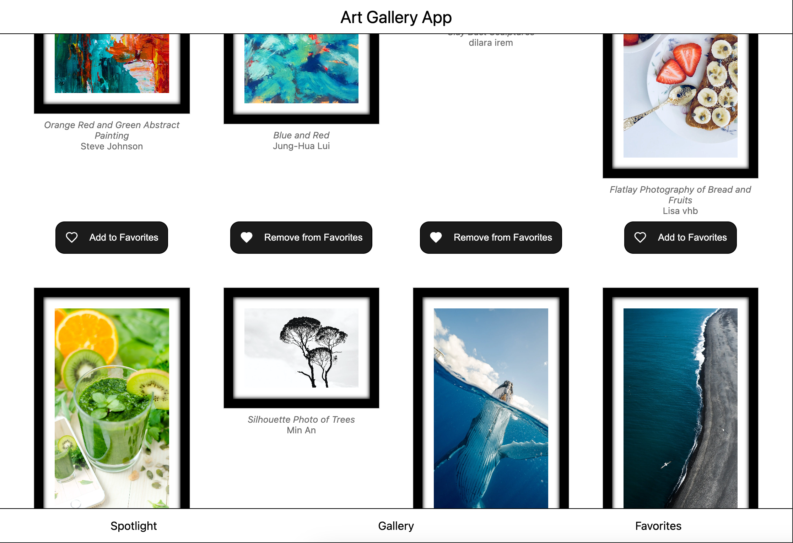

# Next.js Art Gallery

 Screenshot](./public/screenshot.png) <!-- Add a screenshot if available -->

A modern online art gallery built with Next.js showcasing my full-stack development skills. This project demonstrates advanced Next.js features, responsive design, and efficient state management.

## Features

- **Next.js 14** with App Router architecture
- **React 18** with Server Components & Client Components
- **Zustand** for lightweight global state management
- **Responsive Design** with mobile-first approach
- **Image Optimization** with Next.js Image component
- **API Routes** for backend functionality
- **Dynamic Routing** for artwork pages
- **Lazy Loading** for improved performance

## Live Demo

[View Live Demo](https://super-dollop-fjhbc3dyr-daniels-projects-d58a8d33.vercel.app/)

## Installation

1. Clone the repository:
   ```bash
   git clone https://github.com/DanielCyubahiro/super-dollop.git